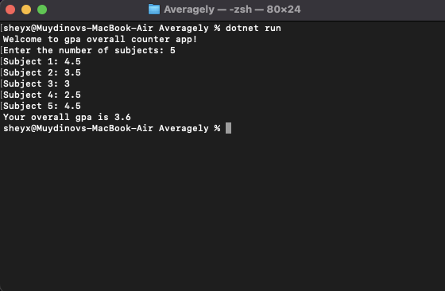

# Averagely
This app will help to students for counting their overall or average gpa!
# GPA Calculator

## Overview

The GPA Calculator is a console application that helps users calculate their overall Grade Point Average (GPA) based on the grades of their subjects. This simple tool is designed to provide an easy way to determine your GPA.

## Features

- Accepts the number of subjects from the user.
- Prompts the user to enter the grade for each subject.
- Calculates the GPA based on the entered grades.
- Displays the overall GPA to the user.

## Getting Started

Follow these steps to run the GPA Calculator:

1. **Clone the Project**: Clone the project repository to your local machine using the following command:

2. **Navigate to the Project Directory**: Use the `cd` command to enter the project directory:

3. **Compile and Run the Program**: Run the program using the following command:

4. **Follow On-Screen Prompts**: The program will guide you through the GPA calculation process. You'll need to input the number of subjects and the corresponding grades.

## Usage

1. **Enter the Number of Subjects**: When you run the program, it will prompt you to enter the number of subjects you want to calculate the GPA for. For example:

2. **Enter Grades**: After specifying the number of subjects, you will be prompted to enter the grade for each subject one by one. 

3. **View GPA**: Once you have entered all the grades, the program will calculate and display your overall GPA:

## Contributing

If you'd like to contribute to this project, please follow these steps:

1. **Fork the Project**: Fork the project repository.

2. **Create a New Branch**: Create a new branch for your feature or bug fix.

3. **Make Changes**: Make your changes and commit them to your branch.

4. **Push Your Branch**: Push your branch to your forked repository.

5. **Create a Pull Request**: Create a pull request to submit your changes for review.

## Example

Here's a visual example of how to use the GPA Calculator:

